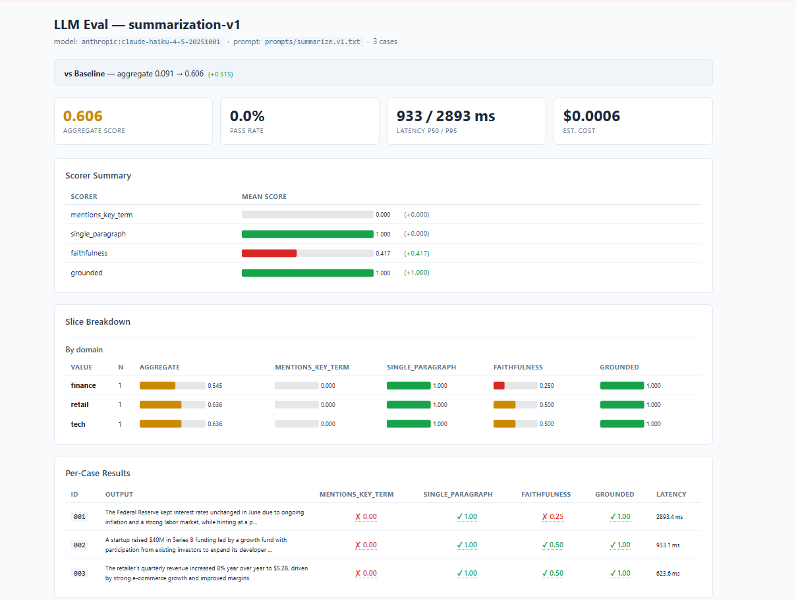
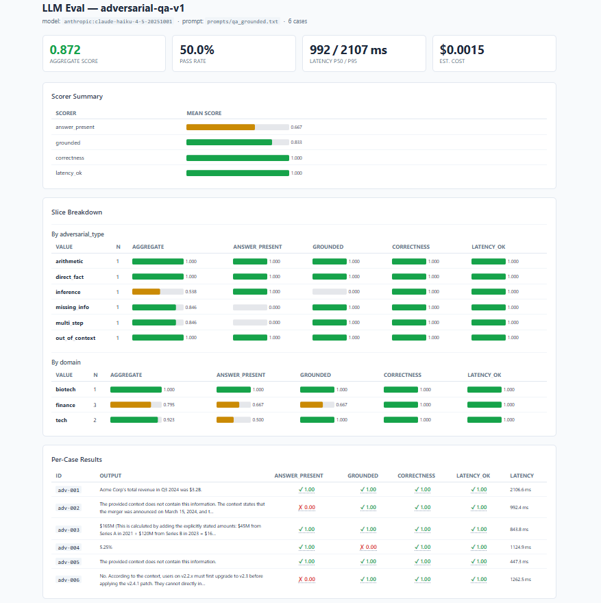

# llm-eval-harness

**Treat prompts and models like code** — a provider-agnostic LLM evaluation framework with deterministic + judge-based scoring, per-slice breakdowns, an HTML dashboard, and a CI gate that fails the build when output quality regresses.


---

## The problem this solves

Most LLM deployments have no regression safety net. A prompt change ships, quality drops, and you find out from a user complaint — not a failing check. This harness changes that:

- Every prompt or model change runs against a versioned golden dataset
- Scores are compared to a committed baseline with a configurable tolerance
- The CI gate exits `1` on regression — the PR can't merge until it's fixed
- Runs fully offline (mock provider) so CI needs **zero API keys**

---

## Live results — Claude Haiku on real test suites

### Summarization suite (3 cases — finance, tech, retail)

| Scorer | Score | What it checks |
|---|---|---|
| single_paragraph | **1.000** ✅ | Output is exactly one line |
| faithfulness | **0.417** 🟡 | LLM judge: no added facts |
| grounded | **1.000** ✅ | Every claim supported by source |
| **Aggregate** | **0.606** | Weighted mean |

> Cost: **$0.0006** per run &nbsp;|&nbsp; Latency p95: **2893 ms**

### Adversarial QA suite (6 cases — designed to tempt hallucination)

| Adversarial type | Score | Notes |
|---|---|---|
| direct_fact | **1.000** ✅ | Clean retrieval |
| arithmetic | **1.000** ✅ | $45M + $120M = $165M ✓ |
| out_of_context | **1.000** ✅ | Correctly refused to hallucinate |
| missing_info | **0.846** 🟡 | Partial — merger announcement vs completion |
| multi_step | **0.846** 🟡 | v2.2→v2.3→v2.4.1 upgrade logic |
| inference | **0.538** 🔴 | Hardest: infer 5.25% by subtracting from 5.50% |
| **Aggregate** | **0.872** | Weighted mean across all 6 cases |

> Cost: **$0.0015** per run &nbsp;|&nbsp; Latency p95: **2107 ms** &nbsp;|&nbsp; Pass rate: **50%**

---

## Dashboard

The `dashboard` command renders a self-contained HTML report — no server, no framework, just open the file in any browser.




Features:
- Traffic-light score bars per scorer
- Baseline diff banner (shows improvement/regression vs last saved run)
- **Slice breakdown** — scores grouped by any `metadata` field (domain, adversarial_type, etc.)
- Per-case table with truncated output, pass/fail icons, and hover tooltips for scorer details
- Latency and cost summary cards

---

## Features

| Feature | Details |
|---|---|
| **8 built-in scorers** | `exact_match`, `contains`, `regex`, `json_schema`, `llm_judge`, `groundedness`, `latency_budget`, `cost_budget` |
| **3 providers** | `mock` (offline/CI), `anthropic`, `openai` — lazy imports, optional extras |
| **Baseline gating** | Commits a baseline JSON; `gate` command diffs and exits 1 on regression |
| **HTML dashboard** | Self-contained report with SVG bar charts and per-case table |
| **Per-slice breakdown** | Scores by any metadata key — catch regressions hiding in one segment |
| **Multi-model sweep** | Compare multiple models/prompts side by side in one command |
| **Disk cache** | `--cache` flag stores completions by hash — re-runs don't re-bill |
| **Cost tracking** | Per-run and per-case cost estimates with a current pricing table |
| **CI integration** | GitHub Actions workflow included — zero keys needed for the gate |

---

## Quickstart

```bash
git clone https://github.com/Viraj-Pathak/llm-eval-harness
cd llm-eval-harness
make install        # pip install -e ".[dev]"
make test           # 15 unit tests — all pass offline
make eval           # run example suite (mock provider, no keys needed)
make baseline       # save current scores as the regression baseline
make gate           # re-run and exit 1 on regression  ← what CI calls
make report         # generate report.html dashboard
```

---

## Using a real model

```bash
pip install -e ".[anthropic]"
$env:ANTHROPIC_API_KEY = "sk-ant-..."   # Windows PowerShell
# export ANTHROPIC_API_KEY=...          # macOS/Linux

# Run with Claude as both task model and judge
python -m llm_eval \
  --judge-provider anthropic \
  --judge-model claude-haiku-4-5-20251001 \
  run suites/summarize.json \
  --provider anthropic \
  --model claude-haiku-4-5-20251001

# Generate HTML dashboard
python -m llm_eval \
  --judge-provider anthropic \
  --judge-model claude-haiku-4-5-20251001 \
  dashboard suites/summarize.json \
  --provider anthropic \
  --model claude-haiku-4-5-20251001 \
  --out report.html
```

---

## Multi-model sweep

Compare two prompt versions side by side:

```bash
python -m llm_eval sweep suites/summarize.json \
  --variants \
    mock:mock-1:prompts/summarize.v1.txt \
    mock:mock-1:prompts/summarize.v2.txt
```

Output:
```
variant                               mentions_key_term  faithfulness  grounded  aggregate  pass_rate
------------------------------------  -----------------  ------------  --------  ---------  ---------
mock:mock-1:prompts/summarize.v1.txt  0.000              0.000         0.000     0.091      0.0%
mock:mock-1:prompts/summarize.v2.txt  0.000              0.000         0.000     0.091      0.0%
```

---

## CLI reference

```
python -m llm_eval [--judge-provider PROVIDER] [--judge-model MODEL] [--cache] COMMAND

Commands:
  run        suites/X.json [--provider P] [--model M] [--out result.json]
  baseline   suites/X.json [--provider P] [--model M]
  gate       suites/X.json [--provider P] [--model M]
  dashboard  suites/X.json [--provider P] [--model M] [--out report.html]
  sweep      suites/X.json --variants P:M[:PROMPT] P:M[:PROMPT] ...
```

`--cache` persists completions to `.cache/completions/` by SHA-256 hash. Re-runs and judge calls skip the API entirely.

---

## Defining a suite

A suite is one JSON file — no code needed to add a new eval:

```jsonc
{
  "name": "summarization-v1",
  "dataset": "datasets/summarization_golden.jsonl",
  "task": {
    "prompt_path": "prompts/summarize.v1.txt",
    "provider": "mock",
    "model": "mock-1",
    "temperature": 0.0,
    "max_tokens": 256
  },
  "scorers": [
    { "type": "contains",     "name": "mentions_key_term", "weight": 1.0, "threshold": 1.0 },
    { "type": "regex",        "name": "single_paragraph",  "params": { "pattern": "^[^\\n]+$" }, "weight": 0.5 },
    { "type": "llm_judge",    "name": "faithfulness",      "params": { "rubric": "Does the summary accurately reflect the source without adding facts?" }, "weight": 2.0 },
    { "type": "groundedness", "name": "grounded",          "weight": 2.0, "threshold": 1.0 }
  ],
  "regression_tolerance": 0.03
}
```

Dataset format (`.jsonl`, one case per line):

```jsonl
{
  "id": "001",
  "input": { "document": "The Federal Reserve held interest rates steady..." },
  "reference": "Fed held rates steady, hinting at one possible cut.",
  "context": "The Federal Reserve held interest rates steady...",
  "metadata": { "domain": "finance" }
}
```

`metadata` fields automatically appear as slice breakdowns in the dashboard.

---

## Scorer reference

| Type | Description | Needs judge? |
|---|---|---|
| `exact_match` | Strict string equality vs reference | No |
| `contains` | Reference or any listed string appears in output | No |
| `regex` | Pattern matches output | No |
| `json_schema` | Output is valid JSON, optionally matching a schema | No |
| `latency_budget` | Case latency ≤ `budget_ms` | No |
| `cost_budget` | Case cost ≤ `budget_usd` | No |
| `llm_judge` | LLM grades output 1–5 against a rubric → [0,1] | Yes |
| `groundedness` | LLM checks every claim is supported by `case.context` | Yes |

---

## Adding a new scorer

```python
# in llm_eval/scorers.py
class MyScorer(Scorer):
    type = "my_scorer"

    def score(self, case, output, judge=None, **runtime):
        ok = "expected" in output
        return ScoreResult(1.0 if ok else 0.0, detail="found it" if ok else "missing")

# add to _REGISTRY
_REGISTRY["my_scorer"] = MyScorer
```

Then use it in any suite JSON: `{ "type": "my_scorer", "name": "my_check", "weight": 1.0 }`.

---

## Project layout

```
llm_eval/
  config.py       suite/task/scorer config + .jsonl loader
  clients.py      mock / anthropic / openai clients (token usage + latency)
  scorers.py      8 scorers + pluggable registry
  runner.py       execute suite, aggregate scores, per-slice breakdown
  report.py       markdown report + baseline regression diff
  dashboard.py    self-contained HTML report generator
  cache.py        disk cache for completions (keyed by SHA-256)
  __main__.py     CLI: run | baseline | gate | dashboard | sweep

suites/           declarative suite configs (JSON)
datasets/         versioned golden sets (.jsonl)
prompts/          prompt templates ({var} substitution)
results/          baseline JSON files (committed)
.github/
  workflows/
    eval.yml      CI gate — runs on every PR, zero API keys needed
```

---

## CI pipeline

The included GitHub Actions workflow runs on every PR:

1. Install the package
2. Run all unit tests (`pytest`)
3. Run `gate` against the mock baseline — exits 1 on regression

To add a real model gate, add the API key as a GitHub secret and update `eval.yml`:

```yaml
- name: Real model gate
  env:
    ANTHROPIC_API_KEY: ${{ secrets.ANTHROPIC_API_KEY }}
  run: |
    python -m llm_eval \
      --judge-provider anthropic \
      --judge-model claude-haiku-4-5-20251001 \
      gate suites/summarize.json \
      --provider anthropic \
      --model claude-haiku-4-5-20251001
```

---

## Tech stack

- **Python 3.10+** — standard library first
- **jsonschema** — only hard dependency
- **anthropic / openai** — optional extras, lazy-imported
- **pytest + ruff** — dev tooling
- **GitHub Actions** — CI

---

## Design decisions

**Why a CLI tool, not a notebook?**
Notebooks can't gate PRs. A CLI with an exit code can. The whole point is that quality checks happen automatically, not when someone remembers to run a cell.

**Why both deterministic and judge scorers?**
Deterministic scorers are fast, free, and reproducible — use them for anything checkable (format, keywords, schema). Judge scorers handle fuzzy quality that can't be expressed as a rule. Mix both in one suite.

**Why a separate judge model?**
The task model and the judge are configured independently. A common pattern: cheap model generates, stronger model judges. The `--judge-model` flag controls this without touching the suite config.

**Why mock-first?**
The mock provider makes the entire pipeline — including judge scoring — reproducible offline. CI never needs API keys. Real providers are additive.
